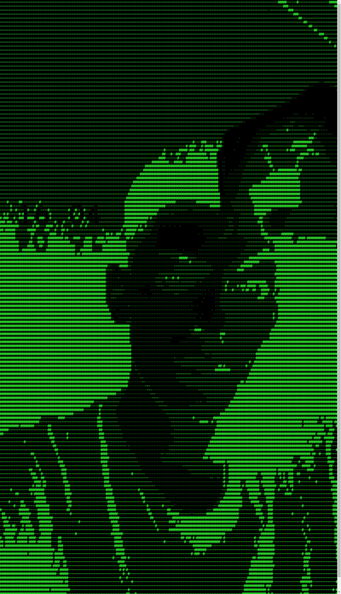
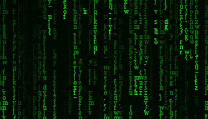

## Hi there 👋

Welcome to my GitHub profile page 🤞

I'm a programmer, Cloud IT Specialist, so... yes.. I'm going to live in cloud ☁
### Read be carefully 😜

## Languages👨🏻‍💻
- ASP.NET Core MVC Framewrok (Microsoft)
- Java
- C#
- PHP
- HTML
- Razor HTML (cshtml)
- CSS
- MySQL (SQL)
- BASH
- Node.js
- .json

## Platform that I use (Software/Framework/IDE)
- Visual Studio
- Visual Studio Code
- Eclipse IDE Java
- ATOM.io
- SQL Server Management Studio (SSMS)
- MySQL
- Apache
- Tomcat
- NODE-RED
- Servlet Java
- Docker Container
- Kubernetes

## Linux
I've worked for 7 years only with Ubuntu distro, from GUI (Graphic User Interface) and CLI (Command Line Interface), from high-school to today, so I prefer to use Linux distro than Windows 10, but I use always both because there are many software that Windows 10 not support... Linux IS SO BETTER!!

## Distro That I prefer
[Pop Os](https://pop.system76.com/)
 
[Manajro (Arch Based OS)](https://manjaro.org/)

<!--
**FraCata00/FraCata00** is a ✨ _special_ ✨ repository because its `README.md` (this file) appears on your GitHub profile.

Here are some ideas to get you started:
-->
- 🔭 I’m currently working on ICT ITS Piemonte Cloud IT Specialist
- 🌱 I’m currently learning so much of the Cloud Arch, software Cloud, etc...
<!--
- 👯 I’m looking to collaborate on ...
- 🤔 I’m looking for help with ...
- 💬 Ask me about ...
- 📫 How to reach me: ...
- 😄 Pronouns: ...
- ⚡ Fun fact: ...
-->
